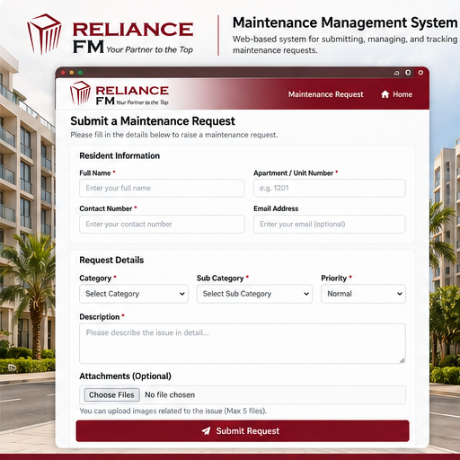
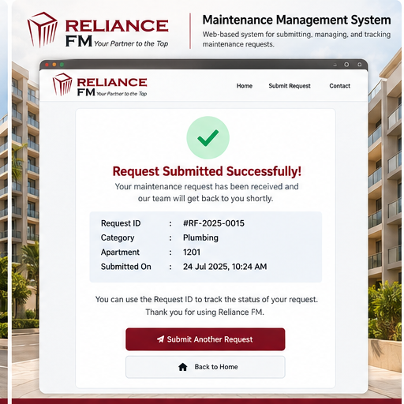
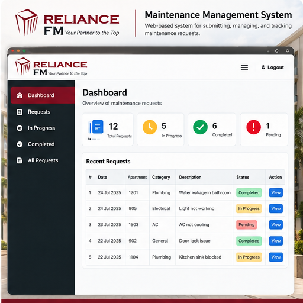
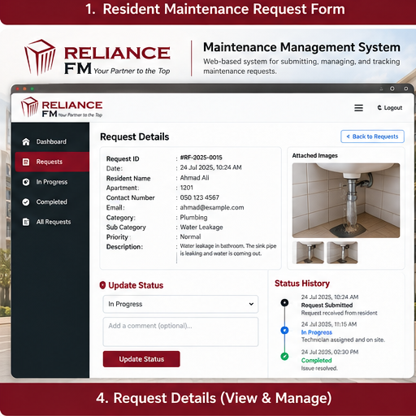
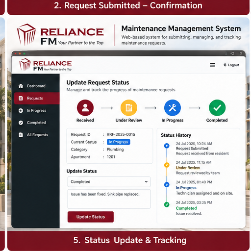
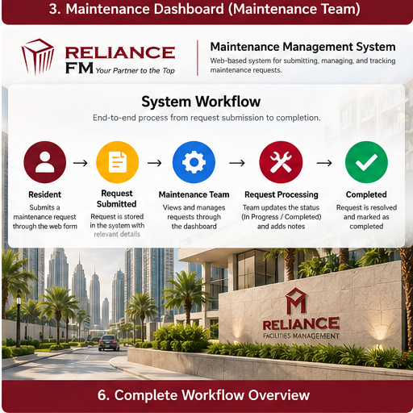

<div align="center">

# 🏢 Maintenance Management System

### Developed for Reliance Facilities Management (Reliance FM) — Dubai

**A digital solution for submitting, managing, tracking, and completing maintenance requests.**

<br>


<br>

**Designed & Developed by Hasan R. H. Abdalhadi**

</div>

<br>

━━━━━━━━━━━━━━━━━━━━━━━━━━━━━━━━━━━━

# 🏢 ABOUT THE SYSTEM

━━━━━━━━━━━━━━━━━━━━━━━━━━━━━━━━━━━━

The **Maintenance Management System** was developed during my internship at **Reliance Facilities Management (Reliance FM), Dubai**.

The system was designed to support the company's maintenance request workflow by creating a structured digital connection between **residents** and the **maintenance team**.

Residents can submit maintenance issues through a dedicated request interface, while the maintenance team can view requests, review their details, track progress, and manage their status until completion.

### 🎯 Main Objectives

- Simplify the maintenance request submission process.
- Organize maintenance requests digitally.
- Provide clear information to the maintenance team.
- Improve request tracking from submission to completion.
- Create a structured workflow between residents and maintenance operations.
- Improve visibility of request status and progress.

<br>

━━━━━━━━━━━━━━━━━━━━━━━━━━━━━━━━━━━━

# ✨ KEY FEATURES

━━━━━━━━━━━━━━━━━━━━━━━━━━━━━━━━━━━━

<div align="center">

**📝 Resident Request Submission**  
↓  
**🆔 Request Identification**  
↓  
**🖥️ Maintenance Dashboard**  
↓  
**🔍 Request Details & Management**  
↓  
**📊 Status Tracking**  
↓  
**✅ Request Completion**

</div>

<br>

━━━━━━━━━━━━━━━━━━━━━━━━━━━━━━━━━━━━

# 👨‍💻 MY CONTRIBUTION

━━━━━━━━━━━━━━━━━━━━━━━━━━━━━━━━━━━━

During my internship, I worked on developing the digital maintenance request solution based on practical maintenance operations and workflow requirements.

My contribution included:

- 💡 Translating maintenance workflow requirements into a digital system.
- 🎨 Designing the resident-facing and maintenance-team interfaces.
- 💻 Developing the web-based user interfaces.
- 🖥️ Designing and structuring the maintenance dashboard.
- 📝 Organizing maintenance request information.
- 📊 Designing the request tracking and status workflow.
- 🔄 Connecting the resident request process with the maintenance management process.
- 🧩 Applying Computer Science and Information Systems concepts to a real operational environment.

<br>

━━━━━━━━━━━━━━━━━━━━━━━━━━━━━━━━━━━━

# 🔄 SYSTEM WORKFLOW

━━━━━━━━━━━━━━━━━━━━━━━━━━━━━━━━━━━━

<div align="center">

### 🏠 Resident
### ↓
### 📝 Request Submitted
### ↓
### 🖥️ Maintenance Team
### ↓
### 🔧 Request Processing
### ↓
### 📊 Status Tracking
### ↓
### ✅ Completed

</div>

<br>

The following sections demonstrate the system process step by step.

---

## 📝 01 ┃ Resident Maintenance Request Form

The process begins when a resident submits a maintenance request through the resident-facing interface.

The resident can provide the information required by the maintenance team, including:

- 👤 Resident information
- 🏠 Apartment / Unit Number
- 📞 Contact details
- 🛠️ Maintenance category
- 📝 Issue description
- 📎 Relevant attachments
- ⚡ Relevant request information

<br>

<div align="center">



</div>

<br>

> **Purpose:** Make reporting maintenance issues simple, structured, and accessible for residents.

---

## ✅ 02 ┃ Request Submitted & Confirmation

After the maintenance request is submitted, the system records the request and provides confirmation.

Important request information can include:

- 🆔 Request ID
- 🛠️ Maintenance category
- 🏠 Apartment / Unit Number
- 📅 Submission information
- ✅ Request confirmation

<br>

<div align="center">



</div>

<br>

> **Purpose:** Provide a clear reference for the submitted maintenance request.

---

## 🖥️ 03 ┃ Maintenance Team Dashboard

Submitted maintenance requests can be viewed through the maintenance team's dashboard.

The dashboard gives the team a centralized overview of maintenance activity and current request status.

### 📊 Dashboard Overview

| Information | Purpose |
|---|---|
| 📥 **Total Requests** | Overall maintenance requests |
| ⏳ **Pending** | Requests waiting for action |
| 🔧 **In Progress** | Requests currently being handled |
| ✅ **Completed** | Resolved maintenance requests |
| 📋 **Recent Requests** | Overview of submitted issues |
| 🔎 **View Request** | Access individual request information |

<br>

<div align="center">



</div>

<br>

> **Purpose:** Provide the maintenance team with one organized location for viewing and managing requests.

---

## 🔧 04 ┃ Request Details & Management

Each maintenance request can be reviewed individually so the maintenance team can understand the reported issue and relevant information.

### 📋 Request Information

- 🆔 Request ID
- 📅 Submission date
- 👤 Resident details
- 🏠 Apartment / Unit Number
- 📞 Contact information
- 🛠️ Maintenance category
- ⚡ Priority
- 📝 Issue description
- 🖼️ Attached issue image
- 📊 Current request status

<br>

<div align="center">



</div>

<br>

> **Purpose:** Keep the information related to each maintenance issue organized and accessible.

---

## 📊 05 ┃ Status Update & Tracking

One of the main parts of the system is following the maintenance request through its different stages.

<div align="center">

### 🔴 RECEIVED
### ↓
### 🟠 UNDER REVIEW
### ↓
### 🔵 IN PROGRESS
### ↓
### 🟢 COMPLETED

</div>

<br>

**🔴 Received**  
The maintenance request has been submitted.

**🟠 Under Review**  
The maintenance team reviews the reported issue.

**🔵 In Progress**  
Maintenance work is being carried out.

**🟢 Completed**  
The maintenance issue has been resolved and the request reaches completion.

<br>

<div align="center">



</div>

<br>

> **Purpose:** Provide visibility into the current stage and progress of each maintenance request.

---

## 🔄 06 ┃ Complete System Workflow

The complete system connects the resident request process with maintenance operations through a structured digital workflow.

<br>

<div align="center">



</div>

<br>

### 🔗 Complete Process

```text
Resident
   │
   ▼
Maintenance Request
   │
   ▼
Request Recorded
   │
   ▼
Maintenance Team Review
   │
   ▼
Request Processing
   │
   ▼
Status Tracking
   │
   ▼
Maintenance Completed
   │
   ▼
Request Closed
```

<br>

━━━━━━━━━━━━━━━━━━━━━━━━━━━━━━━━━━━━

# 💡 PROJECT PURPOSE

━━━━━━━━━━━━━━━━━━━━━━━━━━━━━━━━━━━━

The project demonstrates how a **digital information system** can support practical requirements in **Facilities Management**.

Instead of treating maintenance requests as isolated reports, the system organizes them into a structured workflow where information moves through different operational stages:

<div align="center">

**Submission → Review → Processing → Tracking → Completion**

</div>

<br>

The project combines **Computer Science Engineering**, **Information Systems**, **UI/UX Design**, and practical facilities management experience.

<br>

━━━━━━━━━━━━━━━━━━━━━━━━━━━━━━━━━━━━

# 🛠️ TECHNOLOGIES & SKILLS

━━━━━━━━━━━━━━━━━━━━━━━━━━━━━━━━━━━━

### 💻 Development

`HTML` • `CSS` • `JavaScript` • `Web Interface Development`

### 🗄️ Systems & Data

`Information Systems` • `Data Management` • `Request Tracking` • `Digital Workflows`

### 🎨 Design

`UI/UX Design` • `Resident Interface` • `Administrative Dashboard`

### ⚙️ Operations

`Maintenance Workflow` • `Facilities Management` • `Technical Issue Analysis` • `Process Organization`

### 🧠 Professional Skills

`Problem Solving` • `Requirements Analysis` • `Workflow Design` • `Digital Transformation`

<br>

━━━━━━━━━━━━━━━━━━━━━━━━━━━━━━━━━━━━

# 🏢 INTERNSHIP CONTEXT

━━━━━━━━━━━━━━━━━━━━━━━━━━━━━━━━━━━━

This system was developed during my internship at **Reliance Facilities Management (Reliance FM), Dubai**.

During the internship, I gained practical exposure to:

- 🏢 Residential building operations
- 🔍 Maintenance inspections
- 🔧 Technical issue identification
- 📋 Maintenance quality monitoring
- 🤝 Coordination between field and administrative teams
- 💻 Digital maintenance workflow development

The project allowed me to apply **Computer Science and Information Systems concepts to a real operational environment** and explore how technology can support everyday maintenance operations.

<br>

━━━━━━━━━━━━━━━━━━━━━━━━━━━━━━━━━━━━

# 👨‍💻 DEVELOPER

━━━━━━━━━━━━━━━━━━━━━━━━━━━━━━━━━━━━

<div align="center">

## Hasan R. H. Abdalhadi

### Computer Science Engineering

**BITS Pilani – Dubai Campus**

<br>

`Information Systems` • `Software` • `Data` • `Digital Technologies`

<br>

**Dubai, United Arab Emirates**

<br><br>

*Designed & Developed by Hasan R. H. Abdalhadi*

</div>

<br>

---

<div align="center">

### 🏢 Maintenance Management System

**Developed for Reliance Facilities Management (Reliance FM) — Dubai**

*Computer Science applied to practical facilities management.*

</div>
